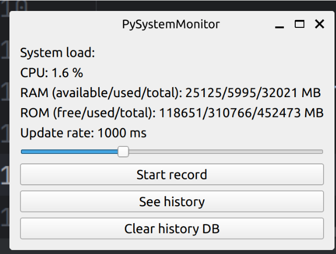
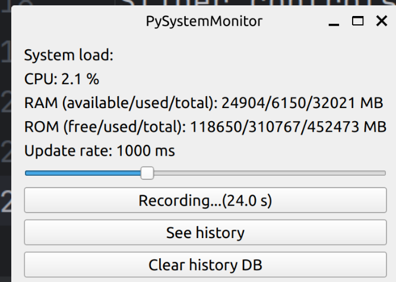
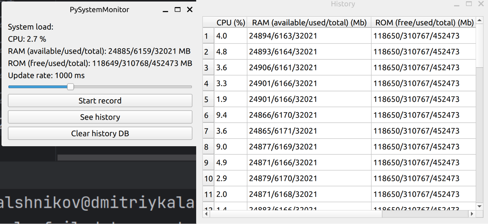

This is a program for monitoring system utilization.

Steps for installing and running this program (after clone from git):

```
python3 venv <pathToClonedRep>
source <venv>/bin/activate
pip3 install ./req.txt
python3 ./main.py
 ```

Main window of this program is looking as shown below:



System metrics are written in up part of the window.

Slider controls frequency of metrics update. 

By clicking on button "Start record" metrics starts writing to the database and write timer are began:



By clicking on button "See history" the window with written metrics is open:



By clicking on button "Clear history db" all writen metrics are deleted from used json DB and text on this button is changed to "Done!".

Working of this app is tested by hand on Ubuntu 22.04 LTS.